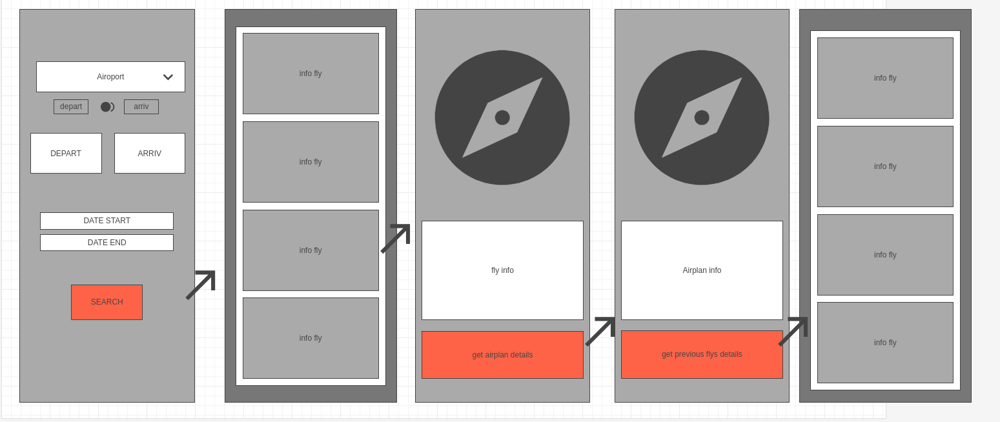

# Air Traffic Monitoring App


## Overview

The Air Traffic Monitoring App is designed to provide real-time flight information and track flights based on user-defined criteria. This application serves as a tool for monitoring flight details within a specified time frame and location.

## Features

- View real-time flight information.
- Track flights based on departure/arrival, specific airports, and time range.
- Interactive map for visualizing flight paths.

## Getting Started

### Prerequisites

- Android Studio
- Android device or emulator

### Installation

1. Clone the repository:

    ```bash
    git clone https://github.com/jeankh/Air-traffic-monitoring
    ```

2. Open the project in Android Studio.

3. Build and run the project on an Android device or emulator.

### Usage

- Upon launching the app, users can set filters for flight details like departure/arrival, airport, and time range.
- Click on a specific flight to view detailed information and track its path on the map.
- For tablets, the app utilizes a split-screen interface to display flight list and map concurrently.
### Maquettte

